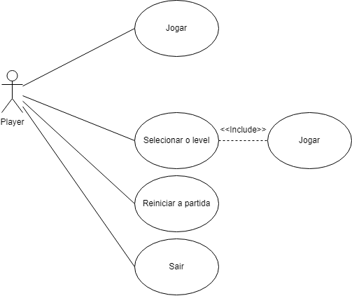

# Análise orientada a objeto
> [!NOTE]
> 
A <strong>análise</strong> orientada a objeto consiste na descrição do problema a ser tratado, duas primeiras etapas da tabela abaixo, a definição de casos de uso e a definição do domínio do problema.

## Descrição Geral do domínio do problema

Descrever de forma geral o domínio do problema.

Possíveis requisitos funcionais e não-funcionais podem ser elencados aqui.

## Diagrama de Casos de Uso

 Jogar -> O jogador vai para a tela de jogar e o programa inicia a contagem de movimentos.

  Selecionar o level -> o jogador pode selecionar um dos **boards** dos níveis(1 a 10)

 Reiniciar a partida-> As peças voltam para a posição inicial e a contagem zera. 

 Voltar -> Volta para o menu inicial.

 Sair -> Fecha o jogo.

## Diagrama de Domínio do problema

Elaborar um diagrama conceitual do domínio do problema.

[Retroceder](README.md) | [Avançar](projeto.md)

