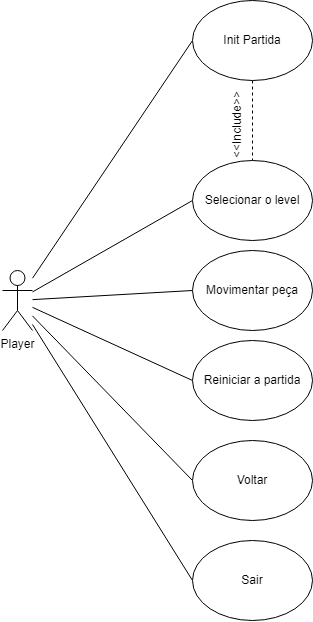
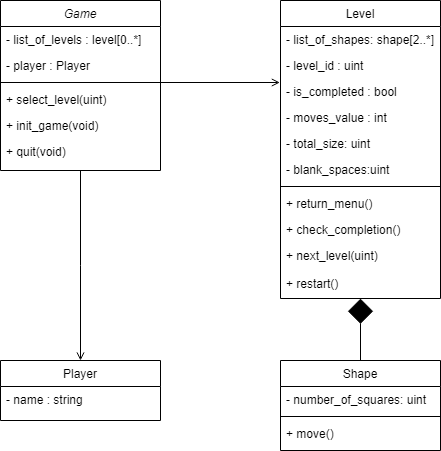

# Análise orientada a objeto

## Descrição Geral do domínio do problema

O jogo Pentaminó envolve a implementação de um sistema baseado em objetos para representar as entidades principais do jogo, como o Game, Player, Level, Shape, e Level Format. O jogo é dividido em níveis (levels), cada um com um conjunto de peças (shapes) que o jogador deve posicionar corretamente. O domínio abrange funcionalidades como iniciar, reiniciar, e sair do jogo, selecionar níveis, e verificar a conclusão dos desafios.

### O jogo proposto:

* Tabuleiro é uma grade 10 (Largura) x 6 (Altura).
* Número variável de peças.
* 7 níveis predefinidos.
* O jogador pode movimentar as peças com o auxilio do mouse.
* O jogador pode escolher entre jogar desde o nível 1 ou jogar um nível específico.
* O jogador pode reiniciar o nível a qualquer momento clicando em um botão.
* O jogador Pode voltar ao menu inicial a qualquer momento.
* Haverá uma contagem de movimentos feitos pelo jogador.

## Diagrama de Casos de Uso

Arrumar:
jogar vira init partida 
tirar o jogar do include e colocar no init partida 
add movimentar peça 

 Jogar -> O jogador vai para a tela de jogar e o programa inicia a contagem de movimentos.

  Selecionar o level -> o jogador pode selecionar um dos **boards** dos níveis(1 a 10).

 Reiniciar a partida-> As peças voltam para a posição inicial e a contagem zera. 

 Voltar -> Volta para o menu inicial.

 Sair -> Fecha o jogo.

## Diagrama de Domínio do problema

Arrumar o diagrama : Level format não existe jogar os atributos na classe level
Mudaro sentido do losango

### Game
* List of Levels: o atributo contém o número de *levels* totais do jogo.
* Player: O atributo contem a sub-classe *Player*.
* Select Level: O método é usado para selecionar o *Level* que vai ser jogado pelo jogador.
* Init Game: Método para iniciar o jogo.
* Quit: Método usado para fechar o jogo.

### Player

* Name: Atributo que contem o nome do jogador

### Level

* List Of Shapes: Atributo que vai conter as peças.
* Level ID: Atributo responsável pela identificação do *level*.
* Level Format: atributo que contem a sub-classe *Level_format*.
* Is Completed: atributo  para ver se o *level* foi Concluído.
* Moves Value: Número de movimentos feito pelo jogador.
* Return menu: Retorna para o menu do jogo 
* Check Completion: Verifica se o *Level* foi concluído
* Next Level: Passa para o próximo *level*
* Restart: Reinicia o *level*
 ### Shape

* Number of Squares: Atributo com o tamanho da peça em quadrados.
* Move: Método usado para movimentar a peça.
  
 ### Level Format

* Total Size: Atributo que contem o tamanho do *board* em quadrados
* Blank spaces: Número de quadrados que ainda não foram preenchidos.

## Layout da tela 

[Retroceder](README.md) | [Avançar](projeto.md)

